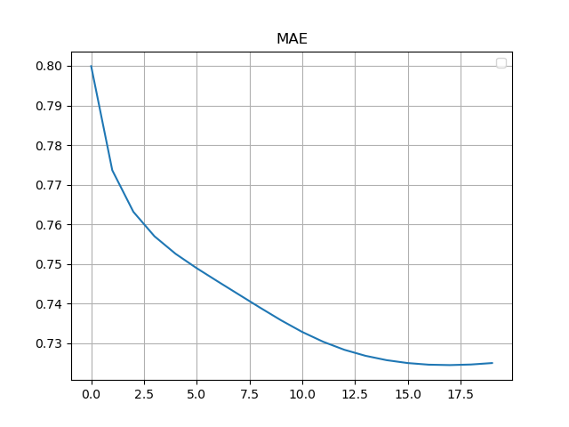

#### 主要功能

推荐系统核心技术之一是协同过滤技术, 协同过滤技术最常用的是矩阵分解 (Matrix Factorization, MF).

#### 基本原理

在隐语义模型 (Latent Factor Model, LFM) 中, 存在一些潜特征. Users 和 Items 是潜空间中的元素. 相似的元素在潜空间中的距离小.

原始矩阵通常描述 Users 和 Items 的关系, 如"评分", 也就和它们在潜空间中的距离矩阵.

将原始矩阵分解, 分解出的两个矩阵称隐因子矩阵, 即为 Users 和 Items 在潜空间中的位置.

#### 应用情况

推荐系统.

#### 优点

高维->低维;

具体实现和求解都很简洁, 预测的精度也比较好;

模型的可扩展性也非常优秀, 其基本思想也能广泛运用于各种场景中.

#### 不足

可解释性差;

冷启动问题(*Group-specific SVD 可在一定程度解决).

#### 其它思考

在很多实际的应用场景中, 只关注 top-k 的结果. 那么, 从上帝视角来看, 评价一个模型好坏的评测指标可以是 "top-k 的准确度".

考虑损失函数能否只计算 top-k' (k'表示一个可能与k, 迭代次数, 参数等有关的数值). 发现难以推导迭代公式. 搜集资料, 难以找到相关资料.

#### 方法

##### SVD

缺点：
1. 补全
2. 计算复杂度高

##### Funk-SVD

近似分解.

##### BiasSVD

在 Funk-SVD 基础上加入偏置项.

优点: 考虑了 (Users 和 Items 的)偏差;

缺点: 冷启动问题.

##### SVD++

在 BiasSVD 基础上考虑邻域(用户历史行为)影响.

##### Asymmetric SVD

使用用户的行为替代用户的喜好(用户隐因子矩阵).

##### Group-specific SVD

解决冷启动问题. 需要"考虑"如何分组.

##### Deep-Learning MF

通过非线性神经架构推广了传统的矩阵分解算法. 发展中.

#### SVD++ 公式推导

模型

$$
\hat{r}_{ui}=b_{ui}+q_i^Tz_u,\\
z_u=p_u+|N(u)|^{-1/2}\sum_{j\in N(u)}y_j,\\
b_{ui}=\mu+b_u+b_i,\\
N(u)=\{i|(u,i)\notin D\}.
$$

损失函数

$$
C=\sum_{ui}e_{ui}^2+\lambda((\sum_{j\in N(u)}|y_j|^2)+(\sum_i|q_i|^2)+(\sum_u|b_u|^2)+(\sum_i|b_i|^2)),\\
e_{ui}=r_{ui}-\hat{r}_{ui}.\\
$$

通过偏导获得递推式

$$
\begin{aligned}
    \cfrac{\partial e_{ui}}{\partial b_{uu}}
    &=-1,\\
    \cfrac{\partial C}{\partial b_{uu}}
    &=-2(e_{ui}-\lambda b_{uu}),\\
    b_{uu}+
    &=\gamma_1(e_{ui}-\lambda b_{uu});\\
    \cfrac{\partial e_{ui}}{\partial b_{ii}}
    &=-1,\\
    \cfrac{\partial C}{\partial b_{ii}}
    &=-2(e_{ui}-\lambda b_{ii}),\\
    b_{ii}+
    &=\gamma_1(e_{ui}-\lambda b_{ii});\\
    \\
    \cfrac{\partial e_{ui}}{\partial p_{uf}}
    &=-q_{if},\\
    \cfrac{\partial C}{\partial p_{uf}}
    &=-2(q_{if}e_{ui}-\lambda p_{uf}),\\
    p_{uf}+
    &=\gamma_2(q_{if}e_{ui}-\lambda p_{uf});\\
    \cfrac{\partial e_{ui}}{\partial q_{if}}
    &=-z_{uf}\\
    &=-(p_{uf}+|N(u)|^{-1/2}\sum_{j\in N(u)}y_{jf}),\\
    \cfrac{\partial C}{\partial q_{if}}
    &=-2(z_{uf}e_{ui}-\lambda q_{if}),\\
    q_{if}+
    &=\gamma_2(z_{uf}e_{ui}-\lambda q_{if});\\
    \\
    \cfrac{\partial e_{ui}}{\partial y_{jf}}
    &=-|N(u)|^{-1/2}\sum_{i\in R(u)}q_{if},\\
    \cfrac{\partial C}{\partial y_{jf}}
    &=-2(e_{ui}|N(u)|^{-1/2}\sum_{i\in R(u)}q_{if}-\lambda y_{jf}),\\
    y_{jf}+
    &=\gamma_3(-\lambda y_{jf}+|N(u)|^{-1/2}\sum_{i\in R(u)}e_{ui}q_{if});\\
    \\
    R(u)
    &=\{i|(u,i)\in D\}.
\end{aligned}
$$

#### 环境搭建

搜索得知有 Python module `surprise` 中有推荐算法相关实现.

##### Manjaro, Python 3.9

报错缺失安装依赖的一个名字很长的包(记不清名字了).
名字很长的包依赖的新版本 `numba` 安装失败, 因为它依赖旧版本 `numpy`.
降级 `numpy`, 依次安装成功, demo 运行成功.

##### Windows 10, Python 3.10

此前已安装过 VS Build Tools, `pip install surprise` 仍报错需要 MSVC 14.0. 
通过 VS Installer 安装 MSVC 14.0 后换了种方式报错, 报错库文件缺失. 
搜索得到另一个基于 Pyrex (`surprise` 也是) 的 Python module 库的 GitHub Issue, 从其中一个 stackoverflow 链接得知需要安装 Windows SDK.
去 VS Installer 里安装最新 Windows 10 SDK, 又换了种方式报错.
去 VS Installer 里安装最新 MSVC 和所有 Windows 10 SDK, 再次安装成功, demo 运行成功.

#### 复现

数据集为 MovieLens-100k.

##### 学习曲线




##### 性能

均为 `n_factors=20, n_epochs=20, gamma=.007, lambda=.02`, 未调用 GPU 加速. 根据 CPU 使用情况判断均以单线程为主.

| -     | `surprise.SVDpp` | `MySVDpp` |
| -     | -         | -         |
| RMSE  | 0.9255    | 0.9279    |
| MAE   | 0.7252    | 0.7283    |
| Time  | 56s       | 769s      |

Error 较为接近, 但运行速度过慢.

#### 优化

##### 成功优化1

考虑递推式

$$
p_{uf}+=\gamma_2(q_{if}e_{ui}-\lambda p_{uf}),\\
q_{if}+=\gamma_2(z_{uf}e_{ui}-\lambda q_{if}).
$$

式中 $f\in[0 ,F]\cap\N,$ 且需要对 $\forall f\in[0 ,F]\cap\N$ 进行如上操作, 即有代码

```py
for f in range(len(latent_factors)):
    ...
```

在代码实现中 $,P,Q$ 的实际定义类型为二维的 `<class 'numpy.ndarray'>`, $p_{uf},q_{if}$ 即为 `P[u, f], Q[i, f]`. 考虑利用 `numpy.ndarray` 特性, 直接对一个向量进行线性计算:

```py
P[u, :] += g2 * (err * Qi - l2 * Pu)
Q[i, :] += g2 * (err * Z - l2 * Qi)
```

`numpy` 底层为 C/C++, 常数比 Python 小很多.

同理, 其它线性或非线性计算也可以如此优化.

##### 失败优化1

更新 P Q 前需要 `.copy()`, 考虑能否通过修改公式不复制.

原递推式简记为

$$
p+=\gamma(qe-\lambda p),
$$

即

$$
p'=p+\gamma qe-\gamma\lambda p,
$$

得

$$
p=\cfrac{p'-\gamma qe}{1-\gamma\lambda}.
$$

通过 $p'$ 得到 $p$ 较为复杂, 开销反而比 `.copy()` 大.


#### 参考资料

MF 的 Wikipedia 页面;

Netflix Prize 比赛相关资料;

Youtube 公开的推荐算法相关资料;

Python module `surprise` 文档及源码.
